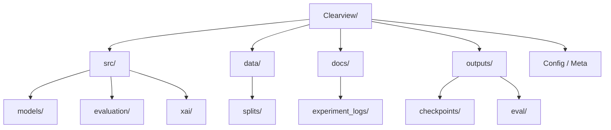

# Repository Manifest: Clearview (Thesis Edition)

This document provides a detailed breakdown of the file structure and the purpose of each component in the `mainline_clean` branch.

## 📁 Repository Structure Overview

---

## 🛠️ Source Code (`src/`)

| Path | Purpose |
| :--- | :--- |
| `src/models/roberta_hierarchical_improved.py` | **Core Architecture**: The final "Improved RoBERTa Hierarchical" model which includes Aspect-Aware Attention, Cross-Aspect Interaction, and the MSR Gated Refinement module. |
| `src/models/train_roberta_improved.py` | **Training Pipeline**: High-performance script for training either the Baseline or MSR models. Supports Adaptive Focal Loss and synthetic data augmentation. |
| `src/evaluation/evaluate_and_log.py` | **Inference & Metrics**: The gold-standard evaluation script. It reproduces results by loading a checkpoint, running predictions on the validation set, and calculating ABSA + MSR-specific metrics. |
| `src/xai/Explainable.py` | **Explainability Suite**: Integrated tools (SHAP, LIME, Captum) used to generate feature importance and attention heatmaps for the thesis. |

---

## 📊 Data Layer (`data/`)

| Path | Purpose |
| :--- | :--- |
| `data/splits/` | Contains the `.parquet` and `.csv` files for reproducible training and testing (`train`, `val`, `test`). |
| `data/splits/README.md` | Provides the schema definition and instructions for the data splits. |

---

## 📜 Documentation & Logs (`docs/`)

| Path | Purpose |
| :--- | :--- |
| `docs/experiment_logs/` | **Scientific Paper Trail**: Contains the chronologically numbered logs (`00` to `07`) detailing the audit, candidate selection, rerunning of evaluations, and archive recommendations. |

---

## 📦 Artifacts (`outputs/`)
*Note: Some items in this folder are intentionally ignored by Git to keep the repo lightweight.*

| Path | Purpose |
| :--- | :--- |
| `outputs/checkpoints/` | **Gold Weights**: Stores `roberta_baseline_seed42.pt` and `roberta_msr_fixed_seed42.pt`. |
| `outputs/eval/` | **Final Results**: Standardized reports (`report.json`), confusion matrices, and the master `comparison.csv` used for the thesis results section. |

---

## ⚙️ Configuration

| File | Purpose |
| :--- | :--- |
| `README.md` | Main orientation file with exact reproduction commands (Train/Eval). |
| `.gitignore` | Logic-driven rules to ensure large binary files (except gold models) are not accidentally committed. |
| `REPO_MANIFEST.md` | You are here: A guide to the repository's anatomy. |
